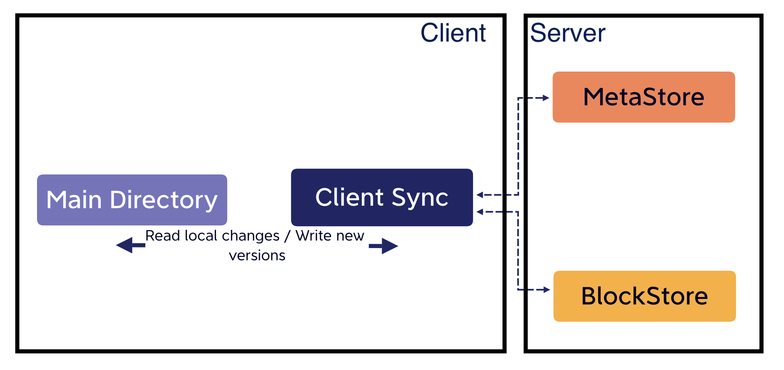
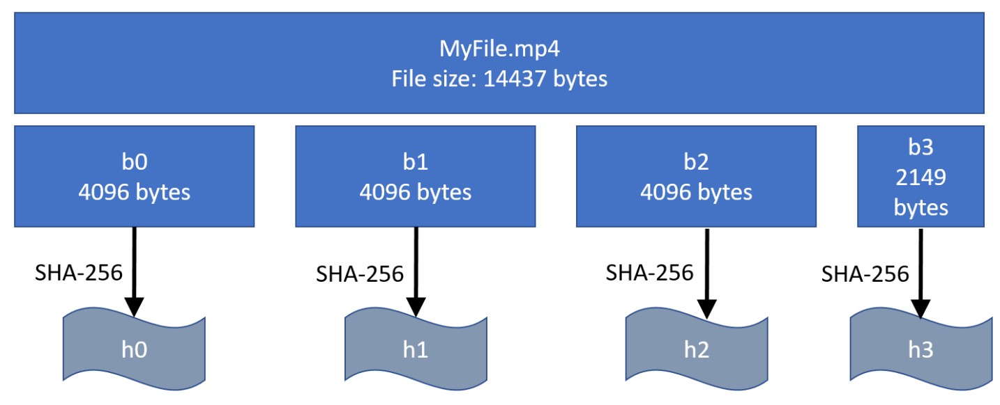
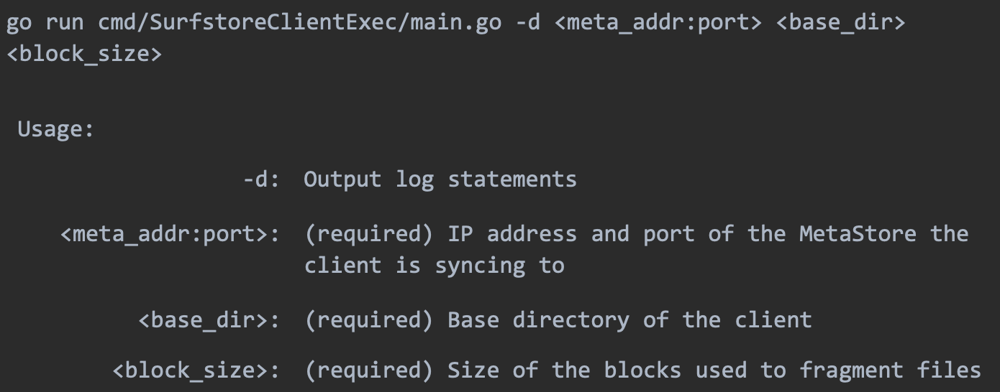
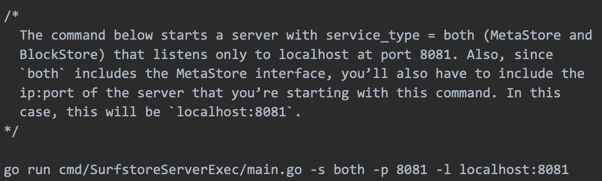
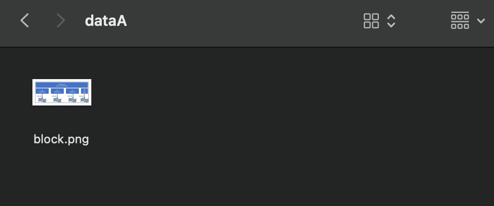
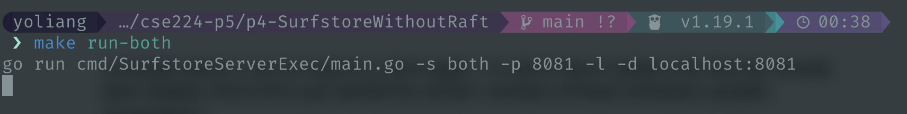
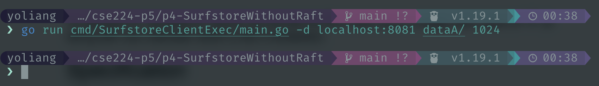
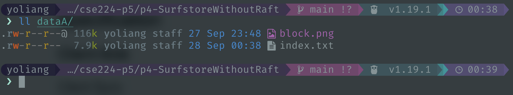
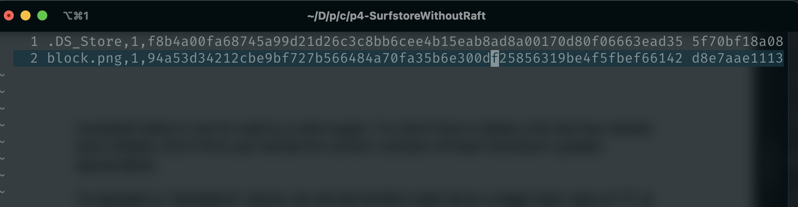
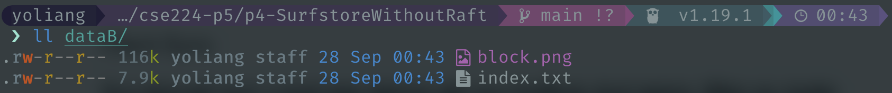

# SurfStore: A Fault-tolerant Cloud File Storage Service 
<p align="center">

</p>

# Overview
SurfStore is a networked file storage application that is modeled after Dropbox, and lets you sync files to and from the "cloud". The service is built with a key-value file storage system including a MetaStore server storing file metadata and a BlockStore server storing real file data, and a client which interacts with the service with gRPC. Moreover, through the implementation of a subset of [RAFT Consensus Algorithm](https://raft.github.io/), the service becomes fault-tolerant.

Multiple clients can concurrently connect to the SurfStore service to access a common, shared set of files. Clients accessing SurfStore “see” a consistent set of updates to files, but SurfStore does not offer any guarantees about operations across files, meaning that it does not support multi-file transactions (such as atomic move).

A command-line tool is also provided to let users interact with the service and play with it easily. For the detail, please see the [Usage](#an-example-to-run-the-program-locally) section.

# Surfstore without RAFT
## Fundamentals
The SurfStore service is composed of the following two services:

- **BlockStore**: The content of each file in SurfStore is divided up into chunks, or blocks, each of which has a unique identifier. This service stores these blocks, and when given an identifier, retrieves and returns the appropriate block.

- **MetaStore**: he MetaStore service manages the metadata of files and the entire system. Most importantly, the MetaStore service holds the mapping of filenames to blocks. Furthermore, it should be aware of available BlockStores and map blocks to particular BlockStores. In a real deployment, a cloud file service like Dropbox or Google Drive will hold exabytes of data, and so will require 10s of thousands of BlockStores or more to hold all that data.

## Blocks, hashes, and hashlists
A file in SurfStore is broken into an ordered sequence of one or more blocks. Each block is of uniform size (defined by the command line argument), except for the last block in the file, which may be smaller (but must be at least 1 byte large). You can consider the following example:

<p align="center">

</p>

For each block, a hash value is generated using the SHA-256 hash function. So for MyFile.mp4, those hashes will be denoted as [h0, h1, h2, h3] in the same order as the blocks. This set of hash values, in order, represents the file, and is referred to as the __hashlist__.

## Versioning 
In this project, we use versioning to solve the file conflict.
Each file/filename is associated with a version, which is a monotonically increasing positive integer. The version is incremented any time the file is created, modified, or deleted. The purpose of the version is so that clients can detect when they have an out-of-date view of the file hierarchy. 

SurfStore only records modifications to files it the version is **exactly** one larger than the currently recorded version. 

## Usage
To run the program and play with it, please enter the folder p4-SurfstoreWithoutRaft and follow the following instructions.
### Client
For this project, clients will sync the contents of a “base directory” by:

<p align="center">

</p>

Command:
```shell
> go run cmd/SurfstoreClientExec/main.go -d <meta_addr:port> <base_dir> <block_size>
```

### Server
As mentioned earlier, Surfstore is composed of two services: MetaStore and BlockStore. In this project, the location of the MetaStore and BlockStore shouldn’t matter. In other words, the MetaStore and BlockStore could be serviced by a single server process, separate server processes on the same host, or separate server processes on different hosts. Regardless of where these services reside, the functionality should be the same.

### Starting a Server
You can start a server by:

<p align="center">

</p>

Command:
```shell
> go run cmd/SurfstoreServerExec/main.go -s <service_type> -p <port> -l -d (blockstoreAddr*)
```

You can also run both server (MetaStore and BlockStore) in a single process

<p align="center">

</p>

Example Command:

```shell
> go run cmd/SurfstoreServerExec/main.go -s both -p 8081 -l localhost:8081
```

<br>

# Run Locally with Command-Line
1. In the root directory of this project, we should first enter the "p4-SurfstoreWithOutRaft" directory.
    ```shell
    > cd p4-SurfstoreWithoutRaft/
    ```
<br>

2. Then we can create two folders, for example, dataA and dataB here.
    ```shell
    > mkdir dataA dataB
    ```
<br>

3. Now we can drag some files into the dataA or dataB folder (I put a png file (block.png) in the dataA folder, for example)

<p align="center">
    
</p>
<br>

4. In the terminal, we can use the following command to start both MetaStore and BlockStore servers.
    ```shell
    > make run-both
    ```
<p align="center">

</p>
<br>

5. Then in another terminal (recommand using `tmux` here), we can run the main.go for Client Execution. We first run the client with the base directory as dataA.
    ```shell
    > go run cmd/SurfstoreClientExec/main.go -d localhost:8081  dataA/ 1024
    ```
<p align="center">

</p>
<br>

6. If we look at the dataA folder, there should be a file called index.txt which basically store the meta data of the file.

<p align="center">


</p>

<br>

7. Then we re-run the command with the base directory as dataB this time.
    ```shell
    > go run cmd/SurfstoreClientExec/main.go -d localhost:8081  dataB/ 1024
    ```
<br>

8. We can see that the png file is synced from dataA to dataB
<p align="center">

</p>

# SurfStore with RAFT
## Overview

## Usage