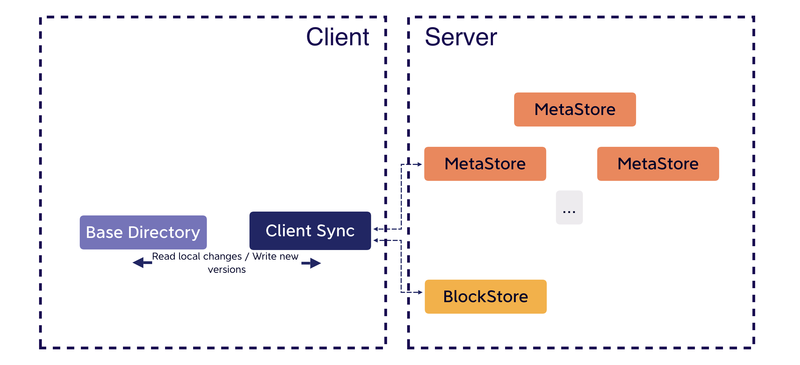
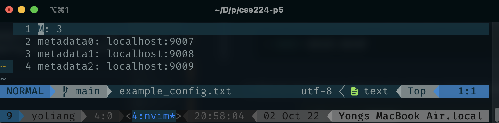
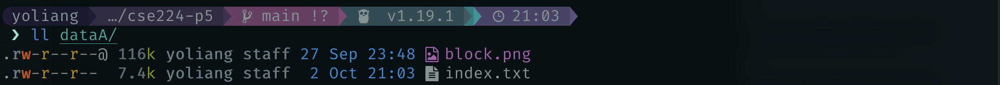
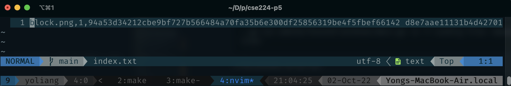
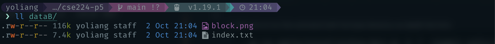

# SurfStore: A Cloud-based Fault-tolerant File Storage Service 
<p align="center">

</p>

# Overview
SurfStore is a networked file storage application that is modeled after Dropbox, and lets you sync files to and from the "cloud". The service is built with a key-value file storage system including a MetaStore server storing file metadata and a BlockStore server storing real file data, and a client which interacts with the service with gRPC. Moreover, through the implementation of a subset of [RAFT Consensus Algorithm](https://raft.github.io/), the service becomes fault-tolerant.

Multiple clients can concurrently connect to the SurfStore service to access a common, shared set of files. Clients accessing SurfStore “see” a consistent set of updates to files, but SurfStore does not offer any guarantees about operations across files, meaning that it does not support multi-file transactions (such as atomic move).

A command-line tool is also provided to let users interact with the service and play with it easily. For the detail, please see the [Usage](#usage) section.

# Surfstore Fundamentals
<p align="center">

</p>
The SurfStore service is composed of the following two services:

- **BlockStore**: The content of each file in SurfStore is divided up into chunks, or blocks, each of which has a unique identifier. This service stores these blocks, and when given an identifier, retrieves and returns the appropriate block.

- **MetaStore**: The MetaStore service manages the metadata of files and the entire system. Most importantly, the MetaStore service holds the mapping of filenames to blocks. Furthermore, it should be aware of available BlockStores and map blocks to particular BlockStores. In a real deployment, a cloud file service like Dropbox or Google Drive will hold exabytes of data, and so will require 10s of thousands of BlockStores or more to hold all that data.

## Blocks, hashes, and hashlists
A file in SurfStore is broken into an ordered sequence of one or more blocks. Each block is of uniform size (defined by the command line argument), except for the last block in the file, which may be smaller (but must be at least 1 byte large). You can consider the following example:

<p align="center">

</p>

For each block, a hash value is generated using the SHA-256 hash function. So for MyFile.mp4, those hashes will be denoted as [h0, h1, h2, h3] in the same order as the blocks. This set of hash values, in order, represents the file, and is referred to as the __hashlist__.

## Versioning 
In this project, we use versioning to solve the file conflict.
Each file/filename is associated with a version, which is a monotonically increasing positive integer. The version is incremented any time the file is created, modified, or deleted. The purpose of the version is so that clients can detect when they have an out-of-date view of the file hierarchy. 

SurfStore only records modifications to files it the version is **exactly** one larger than the currently recorded version. 

# RAFT
Without implementing the RAFT algorithm, our MetaStore server cannot provide a fault-tolerant service. This is simply because we only have one server which stores all the metadata of the files. By implementing the RAFT consensus algorithm, we will have multiple servers in which the metadata is stored. Based on the mechanism of RAFT, as long as most of the servers are alive, then our service can operate normally. For example, if we have 5 MetaStore servers, then we only need 3 of them to be alive to let the SurfStore operates normally. For more information about RAFT, please visit the [RAFT website](https://raft.github.io/).

In this project, only a subset of RAFT algorithms is implemented. More specifically, we did not implement the log compaction and leader election algorithms. For the leader election, we instead created a `setLeader` API. By calling the `setLeader` API, we can simulate the leader election process in the real RAFT algorithm. 

# Requirements to Run
## Go
To run the projects, you first need to install go on your computer. If you are using HomeBrew, just simply run the following command in the terminal:
```shell
> brew install go
```

## Protocol buffer compiler
You can also use HomeBrew to install the Protobuf. If you are in a different environment, please check this [website](https://grpc.io/docs/protoc-installation/) for more detail.
```shell
> brew install protobuf
```
## Go plugins for the protocol compiler
1. Install the protocol compiler plugins for Go using the following commands:
    ```shell
    > go install google.golang.org/protobuf/cmd/protoc-gen-go@v1.28
    > go install google.golang.org/grpc/cmd/protoc-gen-go-grpc@v1.2
    ```

2. Update your PATH so that the protoc compiler can find the plugins:
    ```shell
    > export PATH="$PATH:$(go env GOPATH)/bin"
    ```
For more details, check out the gRPC [Website](https://grpc.io/docs/languages/go/quickstart/#prerequisites).

# Usage
For this project, you can run the program with test code or with the command line. However, I recommend the first option because only through the test program we can really experience the RAFT service since some functionality of RAFT is provided as APIs. You need to call them in your test code. However, this does not mean we cannot run the program in the terminal. In this case, the program will simply select a default node as the leader node and run as normal, but then this is not a real fault-tolerant service.

## Re-generate the Protobuf
You can use the following command to re-generate the protobuf (in the root directory):
```shell
> protoc --proto_path=. --go_out=. --go_opt=paths=source_relative --go-grpc_out=. --go-grpc_opt=paths=source_relative pkg/surfstore/SurfStore.proto
```

## Unit-Test
In this project, you can find some test code I have already written. You can simply run them in the root directory by the following command:
```shell
> make test
```

For more detail, please look at the specific test program code.


## Run with Command-Line
Of course, you can also choose to run the program with the command-line tool. Just follow the following steps:

1. We can first create a config file for the RAFT servers. For example, I created a .txt file called "example_config.txt" in the root directory. In this config file, I specified 3 MetaStore servers.

<p align="center">
    
</p>
<br>

2. Then we need to specify the base directory. Here, I create two folders, for example, dataA and dataB.
    ```shell
    > mkdir dataA dataB
    ```
<br>

3. Now we can drag some files into the dataA or dataB folder (I put a png file (block.png) in the dataA folder, for example)

<p align="center">
    
</p>
<br>

4. In the terminal, we can first use the following command to start the BlockStore servers. (Recommend using `tmux` for the following steps)
    ```shell
    > make run-blockstore   
    ```

5. Then in another terminal, we need to start the raft server. Here you can choose to run multiple RAFT servers or just one (based on your config files).
    ```shell
    > make IDX=0 run-raft
    ```
    If you want to run multiple servers, just run the same command with different `IDX` in another terminal. In this example, we need to run 3 servers:
    ```shell
    > make IDX=1 run-raft
    > make IDX=2 run-raft // in a different terminal
    ```

6. Then we can run the client to sync the files in the specified base directory. To do this, use the following command:
    ```shell
    > go run cmd/SurfstoreClientExec/main.go -d -f <config file> <base directory> <block size>
    ```
    In this example, we can use:
    ```shell
    > go run cmd/SurfstoreClientExec/main.go -d -f ./example_config.txt ./dataA 1024
    ```
    After running you should see an `index.txt` file appear in the dataA folder. This is a file that records the local metadata.
<p align="center">


</p>

<br>

7. Then we re-run the command with the base directory as dataB this time.
    ```shell
    > go run cmd/SurfstoreClientExec/main.go -d -f ./example_config.txt ./dataB 1024
    ```
<br>

8. We can see that the png file is synced from dataA folder to dataB folder
<p align="center">

</p>